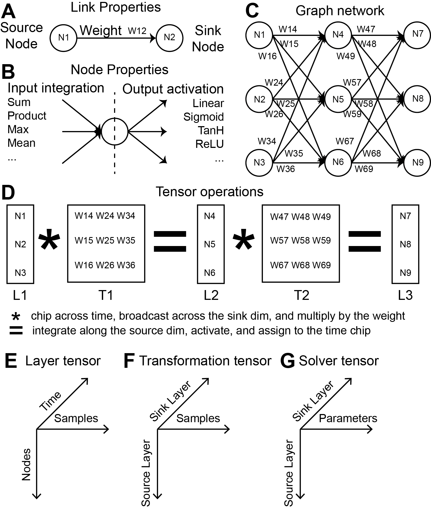
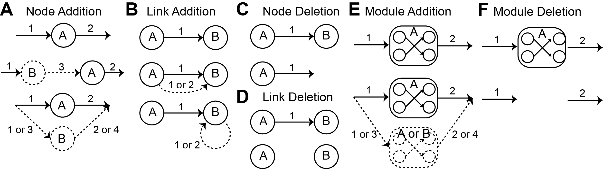

EvoNet: Evolving end-to-end computational networks
##########################################################################################################
|docs| |circleci| |license|

.. begin_badges

.. |docs| image:: https://readthedocs.com/projects/evonet/badge/?version=latest
   :alt: Documentation Status
   :target: https://evonet.readthedocs.io/en/latest/?badge=latest

.. |circleci| image:: https://circleci.com/gh/dmccloskey/EvoNet.svg?branch=develop?style=svg
   :alt: CircleCI Build Status (Windows, Linux & macOS)
   :target: https://circleci.com/gh/dmccloskey/EvoNet

.. |license| image:: https://img.shields.io/github/license/dmccloskey/EvoNet.svg
   :alt: License MIT Clause
   :target: https://github.com/dmccloskey/EvoNet/blob/develop/LICENSE

.. end_badges

.. begin_introduction

EvoNet aims to provide a machine learning framework that can optimize both network weights AND network structure simultaneously while still taking advantage of the latest hardware acceleration technology (Fig 1).

Currently, network structure is optimized using an evolutionary algorithm over network node integration and activation functions and over node connections (Fig 2), while network weights are optimized using standard backpropogation.

EvoNet is written in C++ and is optimized for hardware acceleration using native threading and CUDA GPU technology.

.. end_introduction

.. role:: bash(code)
   :language: bash

Features
==========================================================================================================
.. begin_examples

Examples
----------------------------------------------------------------------------------------------------------
- Full computational networks that include common neural network architecture layers including fully connected, recurrent, LSTM, convolution, softmax, and many other.
- Full computational networks for the analysis and simulation of biochemical networks (work in progress...).
- Benchmarks on various MNIST related classification and reconstruction tasks.
- Benchmarks using various Omics data (work in progress...).
- All examples can be found in the `./src/examples` directory, and can be built using the provided `CMAKE` scripts.

.. begin_examples

.. begin_features

Features
----------------------------------------------------------------------------------------------------------
- End-to-end network building and learning framework that is amenable to back propagation that is made possible by a novel network to tensor layer algorithm.
- Automated neural network architecture and module design that is made possible by a novel ensemble model training, testing, and pruning routines in combination with pre-packed and customizable mutation operators.
- Fine-tuning or specialization of existing architectures for a task using the EvoNet workflow.
- Suite of hand-tuned operators for tensor math, node integration, node activation, network loss functions, and network metric functions that utilize parallelization on CPU or GPU hardware.

.. end_features

.. begin_code

Code
----------------------------------------------------------------------------------------------------------
- Unit tests are provided for (almost) all classes and methods on both CPU and GPU.
- Docstrings and documentation is provided for (almost) all classes and methods.
- Runs on Windows, Linux, and MacOS.  Please note that Windows is currently the most well tested.
- All unit tests can be found in the `./src/tests` directory, and can be ran using `CTest`.

.. end_code